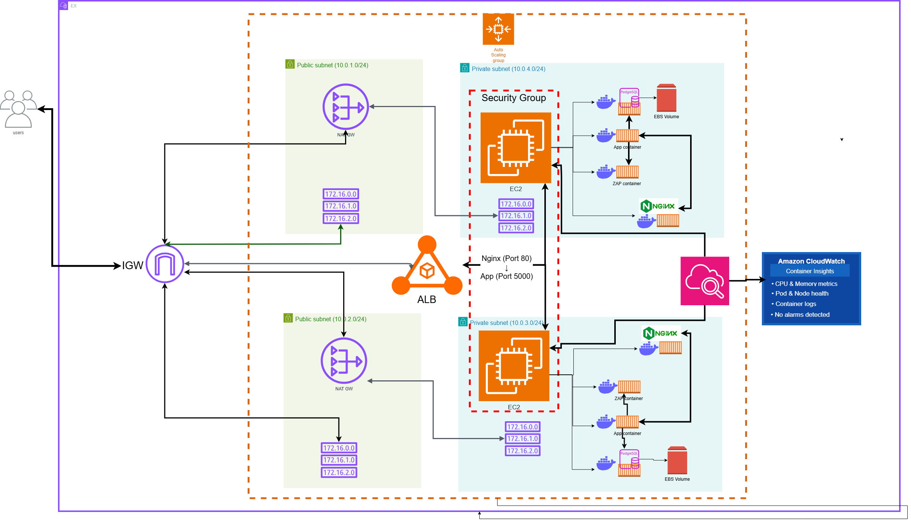
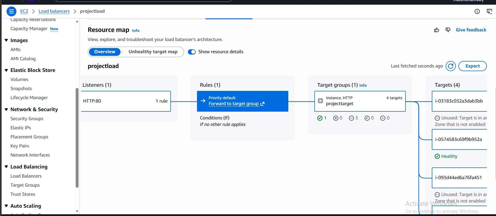
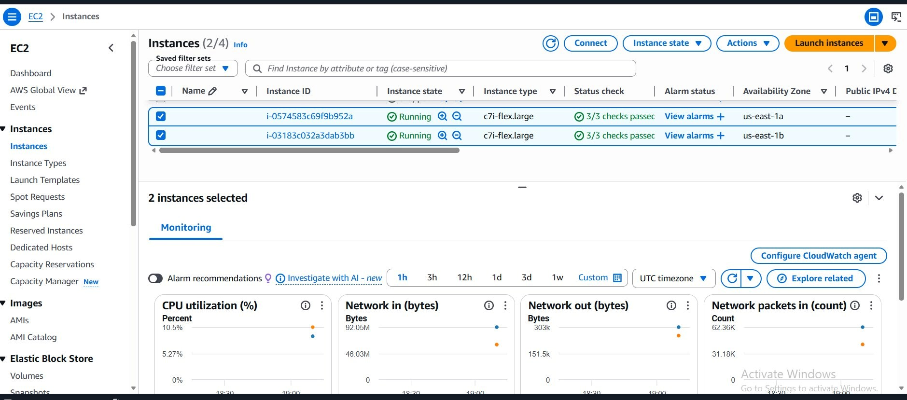
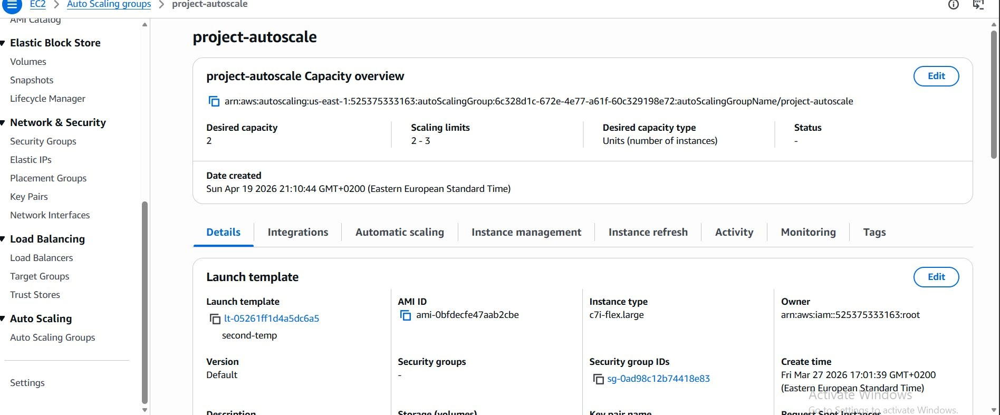

# Approach 1 — EC2-Based Containerized Architecture

### AWS · EC2 · Docker Compose · Nginx · PostgreSQL · OWASP ZAP · OWASP Dependency Check · Nikto · CloudWatch

---

## Architecture



This was the first implementation of the graduation project before migrating to Kubernetes.

The platform was designed and deployed on AWS using EC2 instances and Docker Compose. The goal was to create a secure and scalable environment for automated web vulnerability assessment while following AWS networking and infrastructure best practices.

The deployment spans two Availability Zones and separates public-facing resources from internal workloads using public and private subnets.

---

## Overview

The platform combines multiple services working together to provide automated vulnerability scanning and reporting.

### Core Components

- Nginx Reverse Proxy
- Backend Application
- PostgreSQL Database
- OWASP ZAP
- OWASP Dependency Check
- Nikto
- Amazon CloudWatch

The environment is deployed behind an Application Load Balancer while the application workloads remain isolated inside private subnets.

---

# Infrastructure Design

The infrastructure is built inside a dedicated Amazon VPC.

The design follows a multi-tier architecture:

```text
Internet
   │
   ▼
Internet Gateway
   │
   ▼
Application Load Balancer
   │
   ▼
Private EC2 Instances
   │
   ├── Nginx
   ├── Backend Application
   ├── PostgreSQL
   ├── OWASP ZAP
   ├── Dependency Check
   └── Nikto
```

Key design goals:

- High Availability
- Scalability
- Security
- Observability
- Containerized Deployment

---

# Network Architecture

The infrastructure is distributed across two Availability Zones.

### Networking Components

| Component | Purpose |
|------------|------------|
| VPC | Isolated network |
| Internet Gateway | Public internet access |
| Public Subnets | Host ALB and NAT Gateways |
| Private Subnets | Host EC2 instances |
| NAT Gateways | Secure outbound internet access |
| Security Groups | Traffic filtering |

### Security Model

- EC2 instances are deployed in private subnets.
- No direct internet access to application servers.
- All external traffic passes through the Application Load Balancer.
- Outbound traffic is routed through NAT Gateways.

---

# Application Load Balancer

The Application Load Balancer serves as the single entry point for all incoming traffic.

Responsibilities:

- Distribute traffic across instances
- Perform health checks
- Improve availability
- Route requests to healthy targets

### Configuration

| Setting | Value |
|----------|----------|
| Type | Application Load Balancer |
| Listener | HTTP : 80 |
| Routing | Forward to Target Group |
| Health Checks | Enabled |

### Resource Map



---

# Compute Layer

The application runs on Amazon EC2 instances deployed across two Availability Zones.

### Instance Configuration

| Setting | Value |
|----------|----------|
| Instance Type | c7i-flex.large |
| Availability Zones | us-east-1a, us-east-1b |
| Deployment Model | Private Subnets |
| Health Status | Running |

Each instance hosts the complete Dockerized application stack.

### EC2 Instances



---

# Auto Scaling

An Auto Scaling Group is configured to maintain service availability automatically.

### Configuration

| Setting | Value |
|----------|----------|
| Name | project-autoscale |
| Desired Capacity | 2 |
| Minimum Capacity | 2 |
| Maximum Capacity | 3 |

Benefits:

- Automatic recovery
- High availability
- Self-healing infrastructure
- Controlled scaling

### Auto Scaling Dashboard



---

# Containerized Application Stack

The platform is deployed using Docker Compose.

Each EC2 instance runs the same set of containers.

## Services

| Service | Purpose |
|----------|----------|
| Nginx | Reverse Proxy |
| Application | Main Platform |
| PostgreSQL | Database |
| OWASP ZAP | Dynamic Security Testing |
| OWASP Dependency Check | Dependency Analysis |
| Nikto | Web Server Security Scanning |

---

## Docker Compose Features

Implemented features include:

- Multi-container deployment
- Service dependency management
- Health checks
- Persistent volumes
- Internal networking
- Restart policies
- Environment-based configuration
- Centralized logging

---

# Internal Communication

Containers communicate through a dedicated Docker network.

```yaml
networks:
  zap_network:
    driver: bridge
```

Application flow:

```text
Nginx
  │
  ▼
Application
  ├── PostgreSQL
  ├── OWASP ZAP
  ├── Dependency Check
  └── Nikto
```

This allows secure communication between services without exposing them externally.

---

# Reverse Proxy Layer

Nginx acts as the reverse proxy for the application.

Responsibilities:

- Receive incoming requests
- Forward traffic to the backend
- Centralize request handling
- Improve application isolation

Request flow:

```text
User
 ↓
ALB
 ↓
Nginx
 ↓
Application
```

---

# Database Layer

PostgreSQL 15 is used as the primary database.

Responsibilities:

- Store scan results
- Store application data
- Store generated reports metadata

Database persistence is handled through Docker volumes.

### Persistent Volume

```yaml
zap_db_data:
```

This ensures data remains available even after container recreation.

---

# Security Testing

Security testing is integrated directly into the platform.

Instead of relying on a single scanner, multiple security tools are used.

---

## OWASP ZAP

OWASP ZAP provides Dynamic Application Security Testing (DAST).

Capabilities:

- Passive Scanning
- Active Scanning
- Spider Crawling
- Security Header Analysis
- SQL Injection Detection
- XSS Detection

Communication:

```text
Application → OWASP ZAP
```

---

## OWASP Dependency Check

Used for Software Composition Analysis.

Capabilities:

- CVE Detection
- Vulnerable Dependency Discovery
- Dependency Risk Assessment
- Security Reporting

Reports are generated automatically.

---

## Nikto

Nikto is used to assess web server security.

Capabilities:

- Server Misconfiguration Detection
- Dangerous File Discovery
- Outdated Software Detection
- Common Vulnerability Checks

---

# Storage

Persistent storage is provided using Docker volumes backed by Amazon EBS.

### Volumes

| Volume | Purpose |
|----------|----------|
| zap_db_data | PostgreSQL Storage |
| zap_data | OWASP ZAP Workspace |
| depcheck_data | Dependency Check Database |

Additional mounted directories store:

- Application Logs
- Scan Reports
- Uploaded Files
- Nginx Logs

---

# Monitoring and Observability

Amazon CloudWatch is used to monitor the infrastructure and application environment.

Collected metrics include:

- CPU Utilization
- Network Traffic
- Instance Health
- Container Logs
- Resource Usage

CloudWatch provides visibility into both infrastructure performance and application behavior.

---

# Security Practices Applied

The deployment follows several cloud security best practices:

- Private subnet isolation
- Application Load Balancer as the only public entry point
- NAT Gateway for outbound-only internet access
- Security Group restrictions
- Containerized workloads
- Health checks for critical services
- Persistent storage
- Multi-AZ deployment
- Auto Scaling Group integration
- Continuous vulnerability scanning

---

# Challenges

## Service Dependencies

Several services depended on PostgreSQL and OWASP ZAP being available before startup.

This was solved using Docker Compose health checks and conditional startup dependencies.

Example:

```yaml
depends_on:
  db:
    condition: service_healthy
```

---

## Resource Consumption

OWASP ZAP requires significant memory during active scans.

Resource allocation and scan configurations were optimized to ensure stable operation.

---

## Multi-Service Coordination

Running multiple security tools together required careful planning for:

- Networking
- Storage
- Service Communication
- Report Management

Docker Compose simplified orchestration and deployment.

---

# Deployment

### Start Environment

```bash
docker compose up -d
```

### Check Containers

```bash
docker compose ps
```

### View Logs

```bash
docker compose logs -f
```

### Stop Environment

```bash
docker compose down
```

---

# Why I Built a Kubernetes Version

While the EC2 implementation successfully met the project requirements, managing containers manually became more difficult as the platform evolved.

To improve scalability, automation, observability, and infrastructure management, I redesigned the platform using:

- Terraform
- Amazon EKS
- Kubernetes
- EBS CSI Driver
- CloudWatch Container Insights

This became the second implementation of the project.

➡️ **Continue to Approach 2**

[View Kubernetes Deployment](../tf/README.md)

---

*Abdelrahman Mohamed — Graduation Project 2026*
