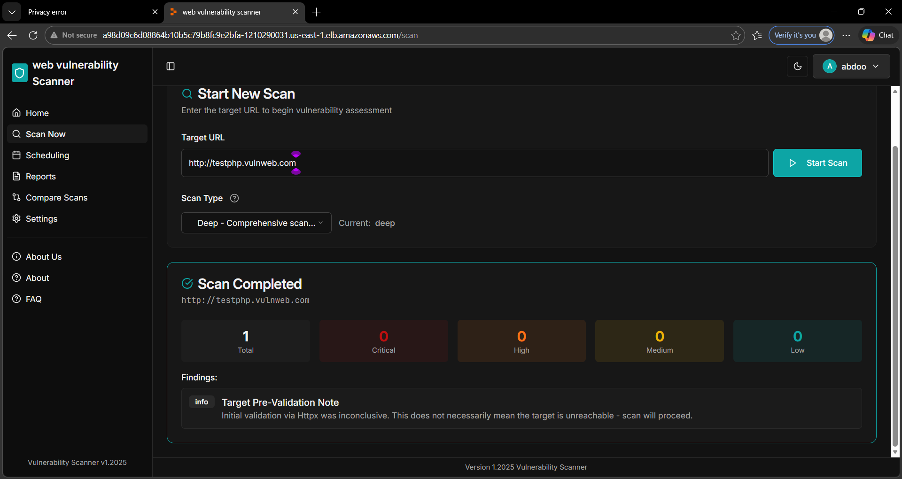
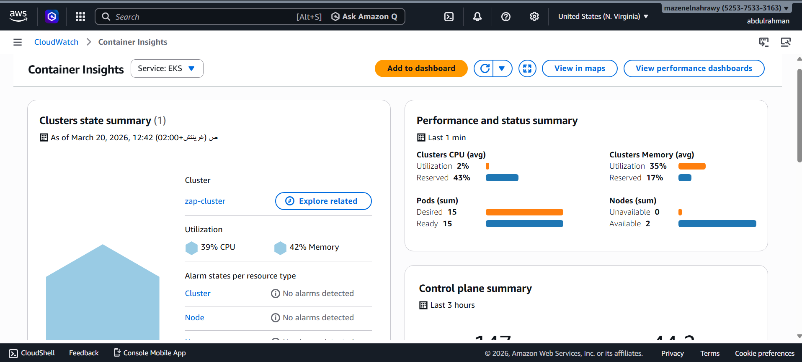

# Cloud Infrastructure & Deployment
### AWS · Terraform · Kubernetes (EKS) · OWASP ZAP · CloudWatch

---

## Overview

AWS infrastructure built with Terraform and Kubernetes (EKS). Everything is defined as code and provisioned with a single `terraform apply` — no clicking through consoles, fully reproducible.

The goal was to build something more than a basic VM deployment — automated provisioning with Terraform, containerized workloads on EKS, security scanning integrated into the cluster, and observability set up from day one.

The setup runs across two Availability Zones inside a private/public subnet split. Worker nodes are never exposed to the internet — only the LoadBalancer service is. Three workloads run inside the cluster: the backend app, PostgreSQL on EBS persistent storage, and OWASP ZAP for dynamic security testing. All monitored via CloudWatch Container Insights.

---

## Architecture


VPC (10.0.0.0/16) across two AZs, each with a public and private subnet. An AWS LoadBalancer provisioned by Kubernetes exposes the app externally. Pods communicate internally over ClusterIP — PostgreSQL and ZAP are never reachable from outside the cluster.

---

## Infrastructure

### Networking

Worker nodes sit in private subnets and are completely unreachable from the internet. The only public-facing component is the LoadBalancer. Each private subnet routes outbound traffic through a NAT Gateway in its own AZ, so nodes can pull images and reach AWS APIs without any inbound exposure.

| Component | Value |
|---|---|
| VPC | `10.0.0.0/16` |
| Public Subnets | `10.0.1.0/24` (AZ-a) · `10.0.3.0/24` (AZ-b) |
| Private Subnets | `10.0.2.0/24` (AZ-a) · `10.0.4.0/24` (AZ-b) |
| Internet Gateway | Inbound internet access |
| NAT Gateway | Outbound-only for private nodes |
| Load Balancer | AWS ELB provisioned by Kubernetes — sole external entry point |
| Security Group | Ports 80, 443 inbound |

### EKS Cluster

The cluster control plane is managed by AWS — no need to provision, patch, or maintain master nodes. Worker nodes run in private subnets across both AZs.

| Setting | Value |
|---|---|
| Cluster Name | `zap-cluster` |
| Kubernetes Version | `1.29` |
| Node Instance Type | `t3.small` |
| Node Count | Min: 1 · Desired: 2 · Max: 3 |
| Node Subnets | Private (AZ-a, AZ-b) |
| Endpoint Access | Public (kubectl) + Private (internal) |

### Storage & IAM

PostgreSQL uses a PVC backed by an EBS gp3 volume, automatically provisioned by the EBS CSI Driver. The StorageClass is set to `reclaimPolicy: Retain` — meaning if the PVC is deleted, the EBS volume stays and data isn't lost by accident.

| Workload | Size | Access Mode |
|---|---|---|
| PostgreSQL | 10Gi | ReadWriteOnce |

```yaml
apiVersion: storage.k8s.io/v1
kind: StorageClass
metadata:
  name: gp3
provisioner: ebs.csi.aws.com
parameters:
  type: gp3
  encrypted: "true"
reclaimPolicy: Retain
volumeBindingMode: WaitForFirstConsumer
allowVolumeExpansion: true
```

Three IAM roles: `eks-cluster-role` (control plane), `node-group-role` (worker nodes — ECR read + VPC CNI), `ebs-csi-role` (EBS provisioning).

---

## Kubernetes Workloads

All workloads run under the `zap-project` namespace, keeping project resources isolated from system namespaces on the same cluster.

| Workload | Image | Port | Controller |
|---|---|---|---|
| Backend App | `abdoomohamed/final-v1-app` | 5000 | Deployment |
| PostgreSQL | `postgres:15-alpine` | 5432 | Deployment |
| OWASP ZAP | `ghcr.io/zaproxy/zaproxy:latest` | 8080 | Deployment |

The app is exposed via a Kubernetes **LoadBalancer** service which provisions an AWS ELB automatically. PostgreSQL and ZAP are ClusterIP only — internal to the cluster, no port ever exposed externally.

| Service | Type | Port | External |
|---|---|---|---|
| `zap-app-service` | LoadBalancer | 80 · 32230 | `a4237214f212646728e8307b3acaa232-530901322.us-east-1.elb.amazonaws.com` |
| `postgres` | ClusterIP | 5432 | — |
| `zap` | ClusterIP | 8080 | — |


The app is accessible via the ELB DNS — below is the web vulnerability scanner running live on the cluster.



---

## Traffic Flow

```
User → IGW → AWS ELB (port 80) → App Pod (port 5000)
                                       ├── PostgreSQL (port 5432)
                                       └── OWASP ZAP (port 8080)
```

The LoadBalancer is registered across both AZs.

---

## Security Testing — OWASP ZAP

ZAP is integrated into the cluster itself, not as an external tool — security scanning runs as part of the deployment with no extra setup. The backend calls ZAP via internal Kubernetes DNS (`http://zap:8080`), so the scanner is never exposed to the internet.

It runs three scan types: passive (analyzes traffic, detects missing headers and insecure cookies), active (sends crafted payloads for SQLi, XSS, command injection), and spider (crawls the app to discover all endpoints before scanning).

**Findings from the current deployment:**

| Finding | Severity |
|---|---|
| No HTTPS/TLS | 🔴 High |
| Missing `X-Content-Type-Options` | 🟡 Medium |
| Missing `X-Frame-Options` | 🟡 Medium |
| No Content Security Policy | 🟡 Medium |
| Server version disclosure | 🟢 Low |

TLS is the top priority fix — in production it would be terminated at the load balancer using AWS Certificate Manager (ACM).

---

## Monitoring — CloudWatch

CloudWatch Container Insights is set up at the infrastructure level via Terraform — the `amazon-cloudwatch-observability` addon is installed directly on the EKS cluster and the node group IAM role is granted `CloudWatchAgentServerPolicy`. This means monitoring is ready from the first deployment, with no manual setup.

It collects CPU and memory per pod and node, container logs via Fluent Bit, pod restart counts, and network I/O — all visible in the AWS Console under a single dashboard.




Current status: 15 pods · 2 nodes available · CPU 39% · Memory 42% · No alarms detected across cluster, nodes, namespaces, services, workloads, and pods.

---

## Best Practices Applied

**Infrastructure as Code** — every resource is defined in Terraform. Nothing was created manually through the console, which means the entire setup is version-controlled, reviewable, and can be recreated identically from scratch.

**Private subnets for worker nodes** — nodes have no public IP and are unreachable from the internet. The only inbound path is through the LoadBalancer.

**NAT Gateway for outbound-only access** — private nodes can pull images and reach AWS APIs, but nothing can reach them inbound.

**Least-privilege IAM** — three separate IAM roles, each with only the policies it needs: `eks-cluster-role` for the control plane, `node-group-role` for worker nodes, and `ebs-csi-role` for storage provisioning. No role has more permissions than required.

**EBS encryption at rest** — the StorageClass is configured with `encrypted: "true"`, so all PostgreSQL data is encrypted on disk automatically.

**`reclaimPolicy: Retain`** — if a PVC is deleted, the underlying EBS volume is kept. Data isn't lost by accident; manual cleanup is required, which is the safer default for a database.

**Resource requests and limits on every pod** — PostgreSQL and ZAP both have explicit CPU and memory requests and limits. This prevents any single pod from starving the node and keeps the cluster stable.

**Liveness and readiness probes** — PostgreSQL has both configured. Kubernetes won't route traffic to the pod until it's actually ready, and will restart it automatically if it becomes unhealthy.

**Namespace isolation** — all workloads run under `zap-project`, separated from system namespaces. Makes it easier to manage access, apply policies, and clean up.

**Security scanner inside the cluster** — ZAP runs as a pod and is called via internal DNS. No external port is opened for scanning, keeping the attack surface minimal.

**Observability from day one** — CloudWatch Container Insights is provisioned by Terraform alongside the cluster, not added later. Metrics and logs are available from the first deployment.

**Explicit `depends_on` in Terraform** — critical resources like the CloudWatch addon and EBS CSI Driver explicitly declare their dependencies, preventing race conditions during provisioning.

---

## Challenges

**ZAP kept crashing with OOMKill** — the default memory limits weren't enough for ZAP's scanner. Fixed by raising the limit to 3Gi and disabling large file downloads (`connection.responseBodySize=0`) and excluding heavy file types like `.onnx`, `.zip`, `.mp4` from scans.

**PVCs stuck in Pending** — EBS volumes need the EBS CSI Driver installed and its IAM role properly configured with the right policy. Took debugging to realize the addon needs to be installed *after* the node group is ready, not just after the cluster — solved with explicit `depends_on` in Terraform.

**CloudWatch addon timing** — the `amazon-cloudwatch-observability` addon would fail silently if installed before the node group was fully ready. Added `depends_on = [aws_eks_node_group.main]` to fix it.

**NAT Gateway dependency ordering** — Terraform would sometimes try to create private route tables before the NAT Gateway was ready. Resolved by making the route table resource explicitly depend on the NAT Gateway.

---

## Terraform

```
tf/
├── provider.tf       # AWS provider + version pin
├── variables.tf      # Cluster name, region, instance type, node count
├── network.tf        # VPC, subnets, IGW, NAT Gateway, route tables, security group
├── eks.tf            # EKS cluster, node group, IAM roles, EBS CSI + CloudWatch addons
├── outputs.tf        # Cluster endpoint, subnet IDs, kubectl command
└── k8s/
    ├── namespace.yaml
    ├── storagegb3.yaml
    ├── postgres.yaml
    ├── zap.yaml
    ├── app.yaml
    └── app-service.yaml
```

Terraform handles the dependency ordering automatically — NAT Gateway before route tables, cluster before node group, node group before addons.

```bash
terraform init
terraform plan
terraform apply
```

---

## Deployment

```bash
# 1. Provision infrastructure
terraform init && terraform plan && terraform apply

# 2. Connect kubectl
aws eks update-kubeconfig --region us-east-1 --name zap-cluster

# 3. Deploy workloads
kubectl apply -f k8s/namespace.yaml
kubectl apply -f k8s/storagegb3.yaml
kubectl apply -f k8s/postgres.yaml
kubectl apply -f k8s/zap.yaml
kubectl apply -f k8s/app.yaml
kubectl apply -f k8s/app-service.yaml

# Verify
kubectl get all -n zap-project
kubectl get all -n amazon-cloudwatch
```

---

*Abdelrahman Mohamed — Graduation Project 2026*
