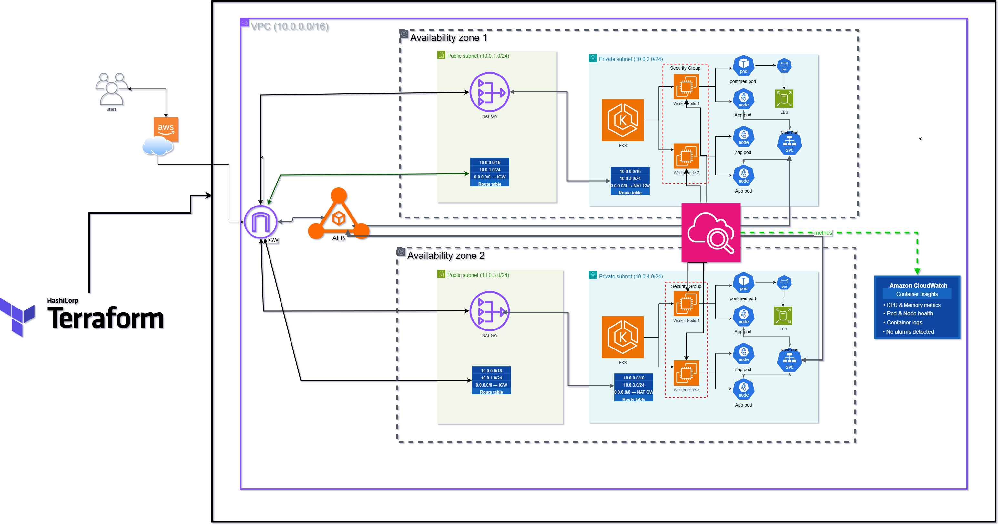
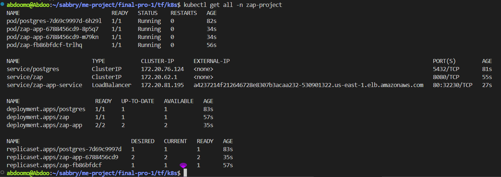
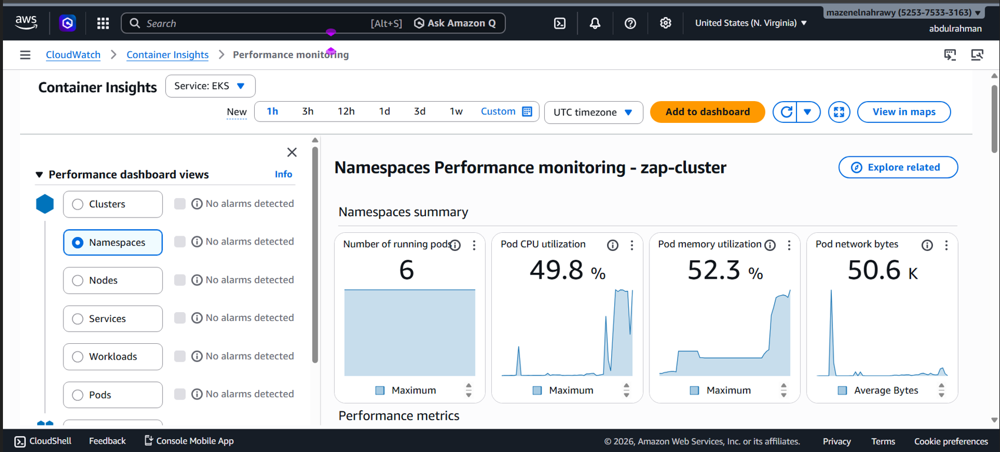
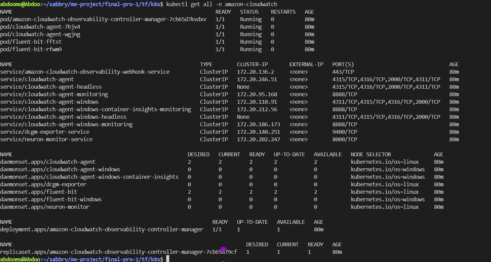

# Cloud Infrastructure & Deployment
### AWS · Terraform · Kubernetes (EKS) · OWASP ZAP · CloudWatch

---

## Overview

Production-grade AWS infrastructure built with Terraform and Kubernetes (EKS). Everything is defined as code and provisioned with a single `terraform apply` — no clicking through consoles, fully reproducible.

The setup runs across two Availability Zones inside a private/public subnet split. Worker nodes are never exposed to the internet — only the LoadBalancer service is. Three workloads run inside the cluster: the backend app, PostgreSQL on EBS persistent storage, and OWASP ZAP for dynamic security testing. All monitored via CloudWatch Container Insights.

---

## Architecture



VPC (10.0.0.0/16) across two AZs, each with a public and private subnet. An AWS LoadBalancer provisioned by Kubernetes exposes the app externally. Pods communicate internally over ClusterIP — PostgreSQL and ZAP are never reachable from outside the cluster.

---

## Infrastructure

### Networking

| Component | Value |
|---|---|
| VPC | `10.0.0.0/16` |
| Public Subnets | `10.0.1.0/24` (AZ-a) · `10.0.3.0/24` (AZ-b) |
| Private Subnets | `10.0.2.0/24` (AZ-a) · `10.0.4.0/24` (AZ-b) |
| Internet Gateway | Inbound internet access |
| NAT Gateway | Outbound-only for private nodes |
| Load Balancer | AWS ELB provisioned by Kubernetes — sole external entry point |
| Security Group | Ports 80, 443 inbound |

### EKS Cluster

| Setting | Value |
|---|---|
| Cluster Name | `zap-cluster` |
| Kubernetes Version | `1.29` |
| Node Instance Type | `t3.small` |
| Node Count | Min: 1 · Desired: 2 · Max: 3 |
| Node Subnets | Private (AZ-a, AZ-b) |
| Endpoint Access | Public (kubectl) + Private (internal) |

### Storage & IAM

Stateful workloads use PVCs backed by EBS gp3 volumes, automatically provisioned by the EBS CSI Driver. Data persists across pod restarts and node failures.

| Workload | Size | Access Mode |
|---|---|---|
| PostgreSQL | 10Gi | ReadWriteOnce |
| ZAP Reports | 5Gi | ReadWriteOnce |

```yaml
apiVersion: storage.k8s.io/v1
kind: StorageClass
metadata:
  name: gp3
provisioner: ebs.csi.aws.com
parameters:
  type: gp3
  encrypted: "true"
reclaimPolicy: Retain
volumeBindingMode: WaitForFirstConsumer
allowVolumeExpansion: true
```

Three IAM roles: `eks-cluster-role` (control plane), `node-group-role` (worker nodes — ECR read + VPC CNI), `ebs-csi-role` (EBS provisioning).

---

## Kubernetes Workloads

All workloads run under the `zap-project` namespace.

| Workload | Image | Port | Controller |
|---|---|---|---|
| Backend App | `abdoomohamed/final-v1-app` | 5000 | Deployment |
| PostgreSQL | `postgres:15-alpine` | 5432 | Deployment |
| OWASP ZAP | `ghcr.io/zaproxy/zaproxy:latest` | 8080 | Deployment |

The app is exposed via a Kubernetes **LoadBalancer** service which provisions an AWS ELB automatically. PostgreSQL and ZAP are ClusterIP only — internal to the cluster.

| Service | Type | Port | External |
|---|---|---|---|
| `zap-app-service` | LoadBalancer | 80 · 32230 | `a4237214f212646728e8307b3acaa232-530901322.us-east-1.elb.amazonaws.com` |
| `postgres` | ClusterIP | 5432 | — |
| `zap` | ClusterIP | 8080 | — |



---

## Traffic Flow

```
User → IGW → AWS ELB (port 80) → App Pod (port 5000)
                                       ├── PostgreSQL (port 5432)
                                       └── OWASP ZAP (port 8080)
```

The LoadBalancer spans both AZs — if one goes down, traffic automatically shifts to the other with no intervention needed.

---

## Security Testing — OWASP ZAP

ZAP runs inside the cluster, called by the backend via internal DNS (`http://zap:8080`) — nothing exposed externally. Runs passive scans (missing headers, insecure cookies), active scans (SQLi, XSS, command injection), and a spider crawl to map all endpoints first.

**Findings from the current deployment:**

| Finding | Severity |
|---|---|
| No HTTPS/TLS | 🔴 High |
| Missing `X-Content-Type-Options` | 🟡 Medium |
| Missing `X-Frame-Options` | 🟡 Medium |
| No Content Security Policy | 🟡 Medium |
| Server version disclosure | 🟢 Low |

TLS is the top priority fix — in production it would be terminated at the load balancer using AWS Certificate Manager (ACM).

---

## Monitoring — CloudWatch

CloudWatch Container Insights set up via Terraform — `amazon-cloudwatch-observability` addon on the cluster, collecting CPU/memory, pod restarts, network I/O, and container logs in real time.





Current status: 6 pods running in `zap-project` · CPU ~49.8% · Memory ~52.3% · No alarms detected across all namespaces, nodes, services, workloads, and pods.

---

## Terraform

```
tf/
├── provider.tf    # AWS provider + version pin
├── variables.tf   # Cluster name, region, instance type, node count
├── network.tf     # VPC, subnets, IGW, NAT Gateway, route tables, security group
├── eks.tf         # EKS cluster, node group, IAM roles, EBS CSI + CloudWatch addons
└── outputs.tf     # Cluster endpoint, subnet IDs, kubectl command
```

Terraform handles the dependency ordering automatically — NAT Gateway before route tables, cluster before node group, node group before addons.

```bash
terraform init
terraform plan
terraform apply
```

---

## Deployment

```bash
# 1. Provision infrastructure
terraform init && terraform plan && terraform apply

# 2. Connect kubectl
aws eks update-kubeconfig --region us-east-1 --name zap-cluster

# 3. Deploy workloads
kubectl apply -f namespace.yaml
kubectl apply -f storagegb3.yaml
kubectl apply -f postgres.yaml
kubectl apply -f zap.yaml
kubectl apply -f app.yaml
kubectl apply -f app-service.yaml

# Verify
kubectl get all -n zap-project
kubectl get all -n amazon-cloudwatch
```

---

*Abdelrahman Mohamed — Graduation Project 2026*
